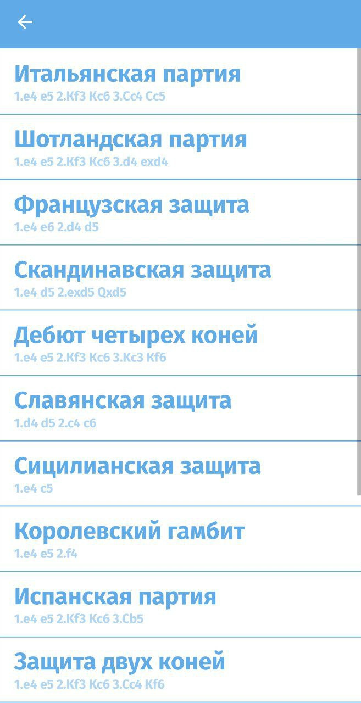

 

  <h3 align="center">База данных шахматных дебютов</h3>

  

    Данный проект представляет из себя приложение на андроид со встроенной базой данных шахматных дебютов
     
     
  

## О проекте

Данный проект был выполнен мной в рамках итогового проекта по дисциплине "Разработка и защита мобильных приложений".

Приложение создано на Xamarin и языке C# с использованием базы данных SQLite. В приложении можно менять язык, а также тему.

У каждого дебюта, описанного в приложении, можно увидеть название, его описание и даже просмотреть ходы, характерные для него. Сами ходы можно переключать при помощи стрелок и видеть анимации, передвигающихся по доске фигур. 
